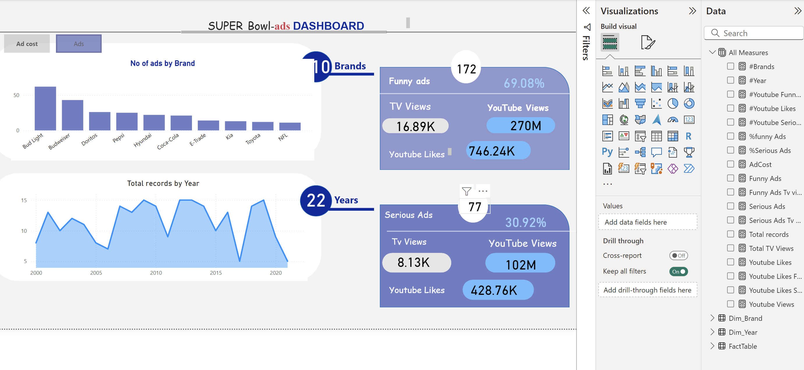
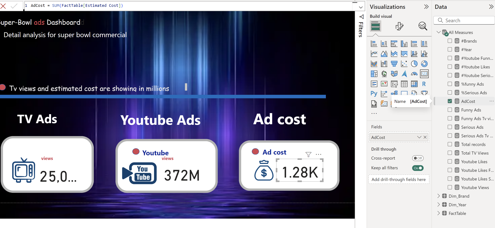

# Super Bowl Ads Dashboard

This repository contains an interactive dashboard providing insights into Super Bowl commercials. The dashboard visualizes data related to ad performance, viewer engagement, and ad costs across brands and years.

## 📊 Insights Gained from the Dashboard

### 1️⃣ **Ad Performance by Brand**
- Bud Light leads the pack with the highest number of ads, followed by Budweiser and Doritos.
- Top brands consistently invest in Super Bowl advertising to maintain visibility.

### 2️⃣ **Yearly Trends**
- Ad data spans 22 years, showcasing fluctuations in the total number of ads over time.
- Notable spikes in ad records indicate increased brand activity in specific years.

### 3️⃣ **Ad Engagement**
- **Funny Ads**:
  - Represent **69.08%** of all ads.
  - Received **270M YouTube views**, **746.24K YouTube likes**, and **16.89K TV views**.
- **Serious Ads**:
  - Represent **30.92%** of all ads.
  - Garnered **102M YouTube views**, **428.76K YouTube likes**, and **8.13K TV views**.

### 4️⃣ **Ad Costs**
- The average estimated cost of Super Bowl ads is displayed, highlighting the investment required to run these campaigns.
- Total ad costs are represented in **millions of dollars** for TV ads.

## 🚀 Features of the Dashboard
- **Interactive Visualizations**: Includes bar charts, line graphs, and KPI cards for comprehensive data analysis.
- **Brand and Year Filters**: Enables users to drill down into specific brands or years for detailed insights.
- **Summary Metrics**: Key metrics such as the number of ads, YouTube views, likes, and estimated costs are highlighted.

## 🛠 Tools Used
- **Power BI**: For creating interactive visualizations and dashboards.
- **Data Source**: Includes ad performance data spanning two decades, featuring metrics like views, likes, and estimated costs.

## 🧠 Use Cases
- **Marketers**: Understand trends in ad engagement to plan future campaigns.
- **Analysts**: Explore ad performance across brands and years to derive actionable insights.
- **Advertisers**: Evaluate the ROI of Super Bowl commercials by studying viewership data.

## 📌 How to Use
1. Clone this repository.
2. Open the Power BI file (`SuperBowlAds.pbix`) to explore the interactive dashboard.
3. Use filters to narrow down data by brand or year.

## 📷 Dashboard Screenshots
### Ads Overview

### Ad Cost and Viewership

---

Feel free to contribute or provide feedback to improve this analysis!

## 🤝 Contributing
We welcome contributions! Fork the repository, make your changes, and submit a pull request.

---

### 📝 License
This project is licensed under the MIT License.
